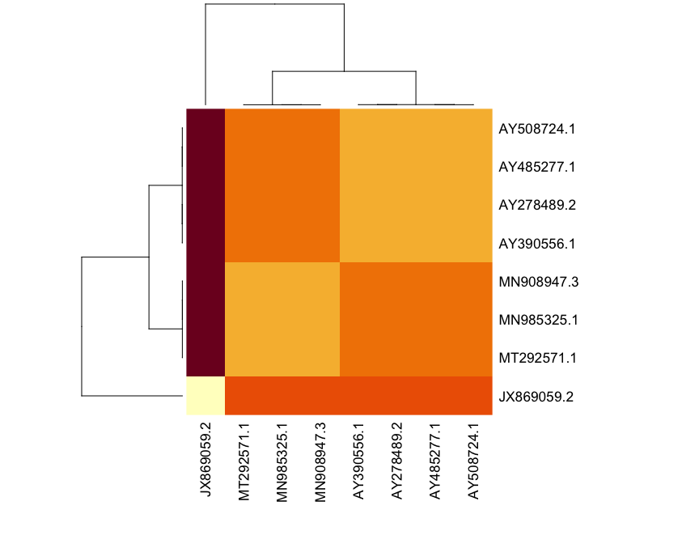
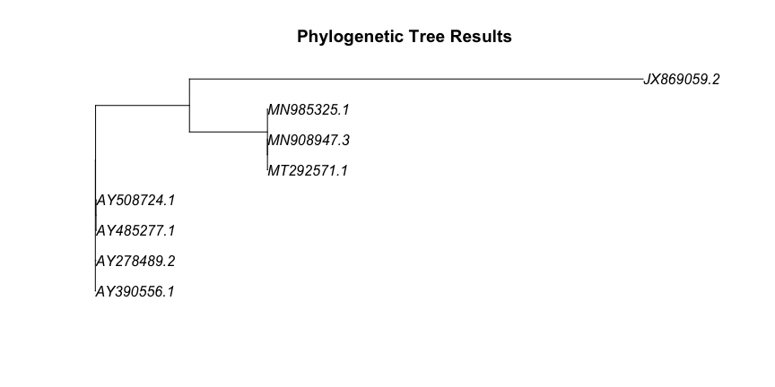
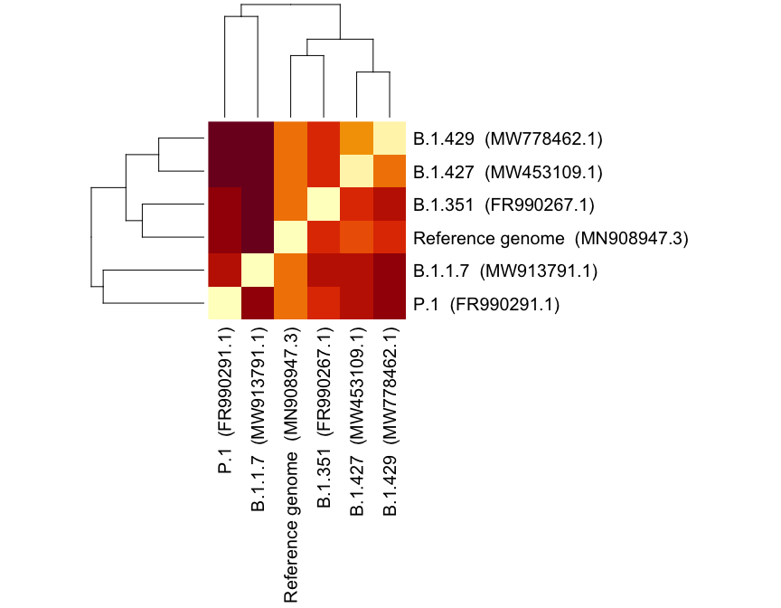

Actividad 4
================

-   [Procedure](#procedure)
    -   [Dependencies](#dependencies)
-   [Analysis 1](#analysis-1)
    -   [Before alignment](#before-alignment)
    -   [Results of sequence alignment (showing only
        first 233)](#results-of-sequence-alignment-showing-only-first-233)
    -   [After alignment](#after-alignment)
    -   [Alignment of the first 1,000
        bases](#alignment-of-the-first-1000-bases)
    -   [Complete alignment](#complete-alignment)
    -   [Difference matrix (between
        sequences)](#difference-matrix-between-sequences)
-   [Analysis 2: Different variants of
    coronavirus](#analysis-2-different-variants-of-coronavirus)
    -   [Before alignment](#before-alignment-1)
    -   [Results of sequence alignment (showing only
        first 360)](#results-of-sequence-alignment-showing-only-first-360)
    -   [After alignment](#after-alignment-1)
    -   [Alignment of the first 1,000
        bases](#alignment-of-the-first-1000-bases-1)
    -   [Complete alignment](#complete-alignment-1)
    -   [Difference matrix (between
        sequences)](#difference-matrix-between-sequences-1)
-   [Key takeaways](#key-takeaways)
-   [References](#references)

Análisis de biología computacional `BT1013.525`

    Bryan Manuel De la O Perea  A01246337
    Andrés Sarellano Acevedo    A01245418
    Maximiliano Villegas García A01635825
    Víctor Manuel Puga Ruiz     A01568636

# Procedure

These are the steps we followed in order to identify the phylogenetic
tree of these variants of the SARS-CoV-2 virus:

-   Collected all the sequences (5 variants + the reference genome).
-   Merged all the `.fastas` in a single file.
-   Used the Clustal Omega tool
    (<https://www.ebi.ac.uk/Tools/msa/clustalo/>) to align the
    sequences.

> Our results can be found in
> <https://www.ebi.ac.uk/Tools/services/web/toolresult.ebi?jobId=clustalo-I20210425-021750-0190-3504822-p2m>
> and
> <https://www.ebi.ac.uk/Tools/services/web/toolresult.ebi?jobId=clustalo-I20210423-005428-0562-5987948-p1m>
> (will only be available for a limited time).

-   Used the aligned sequences to calculate the “Pairwise Distances from
    DNA Sequences”.
-   Used these results to build the tree with “Neighbor-Joining Tree
    Estimation”.

<br/>

-   **NOTE:** We repeated the process with the sequences provided by the
    activity, and another analysis for the sequences we gathered in the
    previous activity.

## Dependencies

``` r
library(seqinr)
suppressMessages(library(Biostrings))
suppressMessages(library(ape))
```

# Analysis 1

``` r
accessions <- c(
  "JX869059", "AY508724", "MN908947", "AY390556", 
  "AY278489", "MN985325", "AY485277", "MT292571"
)

read.file <- function(loc) {
  my_data <- readChar(loc, file.info(loc)$size)
  cat(my_data)
}
```

## Before alignment

``` r
all.seq = read.dna("./virus/MERGED.fasta", format = "fasta")
all.seq
```

    ## 8 DNA sequences in binary format stored in a list.
    ## 
    ## Mean sequence length: 29834.5 
    ##    Shortest sequence: 29732 
    ##     Longest sequence: 30119 
    ## 
    ## Labels:
    ## AY278489.2 SARS coronavirus GD01, complete genome
    ## AY390556.1 SARS coronavirus GZ02, complete genome
    ## AY485277.1 SARS coronavirus Sino1-11, complete genome
    ## AY508724.1 SARS coronavirus NS-1, complete genome
    ## JX869059.2 Human betacoronavirus 2c EMC/2012, complete genom...
    ## MN908947.3 Severe acute respiratory syndrome coronavirus 2 i...
    ## ...
    ## 
    ## Base composition:
    ##     a     c     g     t 
    ## 0.287 0.194 0.204 0.315 
    ## (Total: 238.68 kb)

## Results of sequence alignment (showing only first 233)

``` r
read.file("./virus/aligned-first-places.txt")
```

    ## CLUSTAL O(1.2.4) multiple sequence alignment
    ## 
    ## 
    ## JX869059.2      -------GATTTAAGTGAATAGCTTGGCTATCTCACTTCCCCTCGTTCTCTTGCAGAACT 53
    ## MT292571.1      ------------------------------------------------------AGATCT 6
    ## MN908947.3      ATTAAAGGTTTATACCTTCCCAGGTAACAAACCAACCAACTTTCGATCTCTTGTAGATCT 60
    ## MN985325.1      ATTAAAGGTTTATACCTTCCCAGGTAACAAACCAACCAACTTTCGATCTCTTGTAGATCT 60
    ## AY485277.1      ATATTAGGTTTTTACCTACCCAGG--AAAAGCCAACCAAC-CTCGATCTCTTGTAGATCT 57
    ## AY508724.1      ----------------TACCCAGG--AAAAGCCAACCAAC-CTCGATCTCTTGTAGATCT 41
    ## AY278489.2      ----------------TACCCAGG--AAAAGCCAACCAAC-CTCGATCTCTTGTAGATCT 41
    ## AY390556.1      ATATTAGGTTTTTACCTACCCAGG--AAAAGCCAACCAAC-CTCGATCTCTTGTAGATCT 57
    ##                                                                       *** **
    ## 
    ## JX869059.2      TTGATTTTAACGAACTTAAATAAAAGCCCTGTTGTTTAGCGTATCGTTGCACTTGTCTGG 113
    ## MT292571.1      GTTCTCTAAACGAACTTTAAAATCTGTGTGGCTGT------------------------- 41
    ## MN908947.3      GTTCTCTAAACGAACTTTAAAATCTGTGTGGCTGT------------------------- 95
    ## MN985325.1      GTTCTCTAAACGAACTTTAAAATCTGTGTGGCTGT------------------------- 95
    ## AY485277.1      GTTCTCTAAACGAACTTTAAAATCTGTGTAGCTGT------------------------- 92
    ## AY508724.1      GTTCTCTAAACGAACTTTAAAATCTGTGTAGCTGT------------------------- 76
    ## AY278489.2      GTTCTCTAAACGAACTTTAAAATCTGTGTAGCTGT------------------------- 76
    ## AY390556.1      GTTCTCTAAACGAACTTTAAAATCTGTGTAGCTGT------------------------- 92
    ##                  *  * * ********* ** *   *    * ***                         
    ## 
    ## JX869059.2      TGGGATTGTGGCATTAATTTGCCTGCTCATCTAGGCAGTGGACATATGCTCAACACTGGG 173
    ## MT292571.1      ----------------------------CACTCGGCTGCATGCTTAGTGCACTCACGCAG 73
    ## MN908947.3      ----------------------------CACTCGGCTGCATGCTTAGTGCACTCACGCAG 127
    ## MN985325.1      ----------------------------CACTCGGCTGCATGCTTAGTGCACTCACGCAG 127
    ## AY485277.1      ----------------------------CGCTCGGCTGCATGCCTAGTGCACCTACGCAG 124
    ## AY508724.1      ----------------------------CGCTCGGCTGCATGCCTAGTGCACCTACGCAG 108
    ## AY278489.2      ----------------------------CGCTCGGCTGCATGCCTAGTGCACCTACGCAG 108
    ## AY390556.1      ----------------------------CGCTCGGCTGCATGCCTAGTGCACCTACGCAG 124
    ##                                               ** *** *    * **        **   *
    ## 
    ## JX869059.2      TATAATTCTAATTGAATACTATTTTTCAGTTAGAGCGTCGTGTCTCTTGTACGTCTCGGT 233
    ## MT292571.1      TATAATTAATAACTAA--TTACTGTCGTTGACAGGACACGAGTAACTCGTCTATCTTCTG 131
    ## MN908947.3      TATAATTAATAACTAA--TTACTGTCGTTGACAGGACACGAGTAACTCGTCTATCTTCTG 185
    ## MN985325.1      TATAATTAATAACTAA--TTACTGTCGTTGACAGGACACGAGTAACTCGTCTATCTTCTG 185
    ## AY485277.1      TATAAACAATAATAAATTTTACTGTCGTTGACAAGAAACGAGTAACTCGTCCCTCTTCTG 184
    ## AY508724.1      TATAAACAATAATAAATTTTACTGTCGTTGACAAGAAACGAGTAACTCGTCCCTCTTCTG 168
    ## AY278489.2      TATAAACAATAATAAATTTTACTGTCGTTGACAAGAAACGAGTAACTCGTCCCTCTTCTG 168
    ## AY390556.1      TATAAACAATAATAAATTTTACTGTCGTTGACAAGAAACGAGTAACTCGTCCCTCTTCTG 184
    ##                 *****     *   **   ** * *         *   ** **  ** **   ***

## After alignment

``` r
clust <- read.alignment(
  "./virus/clustalo-I20210425-021750-0190-3504822-p2m.clustal_num",
  format = "clustal", forceToLower = TRUE,
)
dna <- as.DNAbin(clust)
dna
```

    ## 8 DNA sequences in binary format stored in a matrix.
    ## 
    ## All sequences of same length: 33165 
    ## 
    ## Labels:
    ## JX869059.2
    ## MT292571.1
    ## MN908947.3
    ## MN985325.1
    ## AY485277.1
    ## AY508724.1
    ## ...
    ## 
    ## Base composition:
    ##     a     c     g     t 
    ## 0.287 0.194 0.204 0.315 
    ## (Total: 265.32 kb)

## Alignment of the first 1,000 bases

``` r
image.DNAbin(dna[1:1000])
```

<!-- -->

## Complete alignment

``` r
image.DNAbin(dna)
```

<!-- -->

## Difference matrix (between sequences)

``` r
D <- dist.dna(dna, model = "TN93")
D.mat <- as.matrix(D)

heatmap(D.mat, margins = c(10, 10))
```

<!-- -->

``` r
tree <- nj(D)
plot.phylo(tree, main = "Phylogenetic Tree Results")
```

<!-- -->

``` r
plot.phylo(
  unroot(tree), 
  type = "unrooted", 
  no.margin = TRUE,
  use.edge.length = FALSE ## not to scale in order to avoid overlaps
)
```

<!-- -->

# Analysis 2: Different variants of coronavirus

``` r
accessions <- c(
  "MN908947.3" = "Reference genome",
  "MW913791.1" = "B.1.1.7",
  "FR990267.1" = "B.1.351",
  "FR990291.1" = "P.1",
  "MW453109.1" = "B.1.427",
  "MW778462.1" = "B.1.429" 
)
```

## Before alignment

``` r
all.seq = read.dna(
  "../SARS-CoV-2 Sequences (Sample)/SARS-CoV-2 MERGED.fasta", format = "fasta"
)
all.seq
```

    ## 6 DNA sequences in binary format stored in a list.
    ## 
    ## Mean sequence length: 29833.33 
    ##    Shortest sequence: 29692 
    ##     Longest sequence: 29903 
    ## 
    ## Labels:
    ## MN908947.3 Severe acute respiratory syndrome coronavirus 2 i...
    ## MW913791.1 Severe acute respiratory syndrome coronavirus 2 i...
    ## FR990267.1 Severe acute respiratory syndrome coronavirus 2 i...
    ## FR990291.1 Severe acute respiratory syndrome coronavirus 2 i...
    ## MW453109.1 Severe acute respiratory syndrome coronavirus 2 i...
    ## MW778462.1 Severe acute respiratory syndrome coronavirus 2 i...
    ## 
    ## Base composition:
    ##     a     c     g     t 
    ## 0.299 0.184 0.196 0.322 
    ## (Total: 179 kb)

## Results of sequence alignment (showing only first 360)

``` r
read.file("../SARS-CoV-2 Sequences (Sample)/aligned-first-360-places.txt")
```

    ## CLUSTAL O(1.2.4) multiple sequence alignment
    ## 
    ## MW913791.1      ------------------------------------------------------AGATCT 6
    ## FR990267.1      --------------------------------------actttcgatctcttgtagatct 22
    ## MW453109.1      -----------------------------------CCAACTTTCGATCTCTTGTAGATCT 25
    ## FR990291.1      attaaaggtttataccttcccaggtaacaaaccaaccaactttcgatctcttgtagatct 60
    ## MN908947.3      ATTAAAGGTTTATACCTTCCCAGGTAACAAACCAACCAACTTTCGATCTCTTGTAGATCT 60
    ## MW778462.1      --------TTTATACCTTCCCAGGTAACAAACCAACCAACTTTCGATCTCTTGTAGATCT 52
    ##                                                                       ******
    ## 
    ## MW913791.1      GTTCTCTAAACGAACTTTAAAATCTGTGTGGCTGTCACTCGGCTGCATGCTTAGTGCACT 66
    ## FR990267.1      gttctctaaacgaactttaaaatctgtgtggctgtcactcggctgcatgcttagtgcact 82
    ## MW453109.1      GTTCTCTAAACGAACTTTAAAATCTGTGTGGCTGTCACTCGGCTGCATGCTTAGTGCACT 85
    ## FR990291.1      gttctctaaacgaactttaaaatctgtgtggctgtcactcggctgcatgcttagtgcact 120
    ## MN908947.3      GTTCTCTAAACGAACTTTAAAATCTGTGTGGCTGTCACTCGGCTGCATGCTTAGTGCACT 120
    ## MW778462.1      GTTCTCTAAACGAACTTTAAAATCTGTGTGGCTGTCACTCGGCTGCATGCTTAGTGCACT 112
    ##                 ************************************************************
    ## 
    ## MW913791.1      CACGCAGTATAATTAATAACTAATTACTGTCGTTGACAGGACACGAGTAACTCGTCTATC 126
    ## FR990267.1      cacgcagtataattaataactaattactgtcgttgacaggacacgagtaactcttctatc 142
    ## MW453109.1      CACGCAGTATAATTAATAACTAATTACTGTCGTTGACAGGACACGAGTAACTCGTCTATC 145
    ## FR990291.1      cacgcagtataattaataactaattactgtcgttgacaggacacgagtaactcgtctatc 180
    ## MN908947.3      CACGCAGTATAATTAATAACTAATTACTGTCGTTGACAGGACACGAGTAACTCGTCTATC 180
    ## MW778462.1      CACGCAGTATAATTAATAACTAATTACTGTCGTTGACAGGACACGAGTAACTCGTCTATC 172
    ##                 ***************************************************** ******
    ## 
    ## MW913791.1      TTCTGCAGGCTGCTTACGGTTTCGTCCGTGTTGCAGCCGATCATCAGCACATCTAGGTTT 186
    ## FR990267.1      ttctgcaggctgcttacggtttcgtccgtgttgcagccgatcatcagcacatctaggttt 202
    ## MW453109.1      TTCTGCAGGCTGCTTACGGTTTCGTCCGTGTTGCAGCCGATCATCAGCACATCTAGGTTT 205
    ## FR990291.1      ttctgcaggctgcttacggtttcgtccgtgttgcagccgatcatcagcacatctaggttt 240
    ## MN908947.3      TTCTGCAGGCTGCTTACGGTTTCGTCCGTGTTGCAGCCGATCATCAGCACATCTAGGTTT 240
    ## MW778462.1      TTCTGCAGGCTGCTTACGGTTTCGTCCGTGTTGCAGCCGATCATCAGCACATCTAGGTTT 232
    ##                 ************************************************************
    ## 
    ## MW913791.1      TGTCCGGGTGTGACCGAAAGGTAAGATGGAGAGCCTTGTCCCTGGTTTCAACGAGAAAAC 246
    ## FR990267.1      tgtccgggtgtgaccgaaaggtaagatggagagccttgtccctggtttcaacgagaaaac 262
    ## MW453109.1      TGTCCGGGTGTGACCGAAAGGTAAGATGGAGAGCCTTGTCCCTGGTTTCAACGAGAAAAC 265
    ## FR990291.1      tgtccgggtgtgaccgaaaggtaagatggagagccttgtccctggtttcaacgagaaaac 300
    ## MN908947.3      CGTCCGGGTGTGACCGAAAGGTAAGATGGAGAGCCTTGTCCCTGGTTTCAACGAGAAAAC 300
    ## MW778462.1      TGTCCGGGTGTGACCGAAAGGTAAGATGGAGAGCCTTGTCCCTGGTTTCAACGAGAAAAC 292
    ##                  ***********************************************************
    ## 
    ## MW913791.1      ACACGTCCAACTCAGTTTGCCTGTTTTACAGGTTCGCGACGTGCTCGTACGTGGCTTTGG 306
    ## FR990267.1      acacgtccaactcagtttgcctgttttacaggttcgcgacgtgctcgtacgtggctttgg 322
    ## MW453109.1      ACACGTCCAACTCAGTTTGCCTGTTTTACAGGTTCGCGACGTGCTCGTACGTGGCTTTGG 325
    ## FR990291.1      acacgtccaactcagtttgcctgttttacaggttcgcgacgtgctcgtacgtggctttgg 360
    ## MN908947.3      ACACGTCCAACTCAGTTTGCCTGTTTTACAGGTTCGCGACGTGCTCGTACGTGGCTTTGG 360
    ## MW778462.1      ACACGTCCAACTCAGTTTGCCTGTTTTACAGGTTCGCGACGTGCTCGTACGTGGCTTTGG 352
    ##                 ************************************************************

## After alignment

``` r
clust <- read.alignment(
  "../SARS-CoV-2 Sequences (Sample)/clustalo-I20210423-005428-0562-5987948-p1m.clustal_num", 
  format = "clustal", forceToLower = TRUE,
)
dna <- as.DNAbin(clust)
dna
```

    ## 6 DNA sequences in binary format stored in a matrix.
    ## 
    ## All sequences of same length: 30406 
    ## 
    ## Labels:
    ## MW913791.1
    ## FR990267.1
    ## MW453109.1
    ## FR990291.1
    ## MN908947.3
    ## MW778462.1
    ## 
    ## Base composition:
    ##     a     c     g     t 
    ## 0.299 0.184 0.196 0.322 
    ## (Total: 182.44 kb)

## Alignment of the first 1,000 bases

``` r
image.DNAbin(dna[1:1000])
```

<!-- -->

## Complete alignment

``` r
image.DNAbin(dna)
```

<!-- -->

## Difference matrix (between sequences)

``` r
D <- dist.dna(dna, model = "TN93")
D.mat <- as.matrix(D)

rows <- sapply(row.names(D.mat), function(i) { paste(accessions[[i]], "  (", i, ")", sep = "") })
cols <- sapply(colnames(D.mat),  function(i) { paste(accessions[[i]], "  (", i, ")", sep = "") })

heatmap(D.mat, margins = c(20, 20), labRow = rows, labCol = cols)
```

<!-- -->

``` r
tree <- nj(D)
labs <- sapply(tree$tip.label, function(i) { paste(accessions[[i]], "  (", i, ")", sep = "") })
tree$tip.label <- labs;

plot.phylo(tree, main = "SARS-CoV-2 Phylogenetic Tree")
```

<!-- -->

``` r
plot.phylo(unroot(tree), type = "unrooted", no.margin = TRUE)
```

<!-- -->

# Key takeaways

-   In the first analysis, some samples of SARS-CoV-2 resemble each
    other a lot. They were probably from an outbreak in the same region
    in similar times.
    -   This is illustrated by the branches in the tree from the same
        node that have similar lengths.
-   In the second analysis, it is shown how the different classified
    variants of the virus are related to each other:
    -   The Reference Genome from Wu Han is *most likely* their
        ancestor.
    -   The other variants are *newer*, as they are farther in the tree.
    -   Our research had previously stated that the `B.1.427` and
        `B.1.429` variants were closely related.

# References

-   *Module 24: An Intro to Phylogenetic Tree Construction in R*.
    Retrieved on April 22, 20221, from
    <https://fuzzyatelin.github.io/bioanth-stats/module-24/module-24.html>

-   *Pairwise Distances from DNA Sequences*. Retrieved on April 22,
    20221, from
    <https://www.rdocumentation.org/packages/ape/versions/5.4-1/topics/dist.dna>

-   *Tajimas D for sequences of different length*. Retrieved on April
    22, 20221, from
    <https://stackoverflow.com/questions/33301632/tajimas-d-for-sequences-of-different-length>
